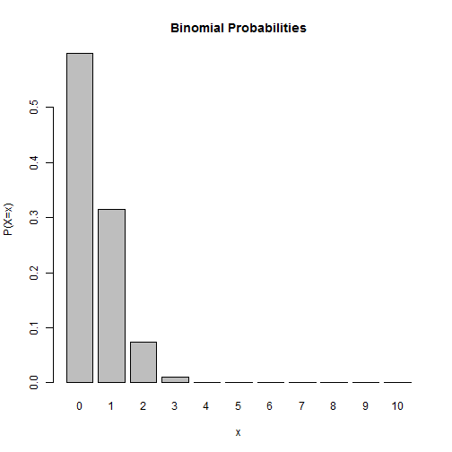
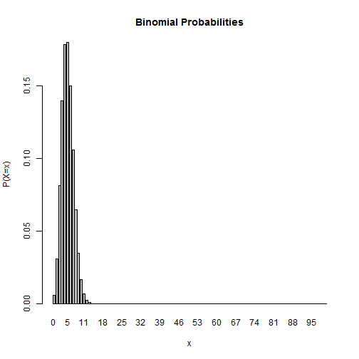

## Introduction

In probability theory and statistics, the binomial distribution with parameters _n_ and **p** is the discrete probability distribution of the number of successes in a sequence of n independent yes/no experiments, each of which yields success with probability p.

The number of successes X follows bino(n,p). For small values of n and p << 0.5 or p >> 0.5 the plot of pmf P(X=x) looks skewed.

But for larger values of n, no matter what the values of p are, the pmf of X looks more like a bell curve.

---

## Small values of n (Example)


```r
n<- 10;p<-0.05;x<-c(0:n);pr<-dbinom(x,n,p);
barplot(pr,space = NULL, ylab = "P(X=x)",xlab = "x",
        main="Binomial Probabilities",names.arg = as.character(x))
```

 


---

## Large values of n (Example)


```r
n<- 100;p<-0.05;x<-c(0:n);pr<-dbinom(x,n,p);
```
 

---

## Conclusion

- For p=0.05, we notice that for small value of n =10 the pmf looks skewed

- For p=0.05, we notice that for small value of n =100 the pmf looks more normal

- Hence when n is large, binomial random variables can be approximated to be normal with mean = np and variance = np(1-p)

Try out diffrent values of n and p at:

https://kmohanty.shinyapps.io/project
